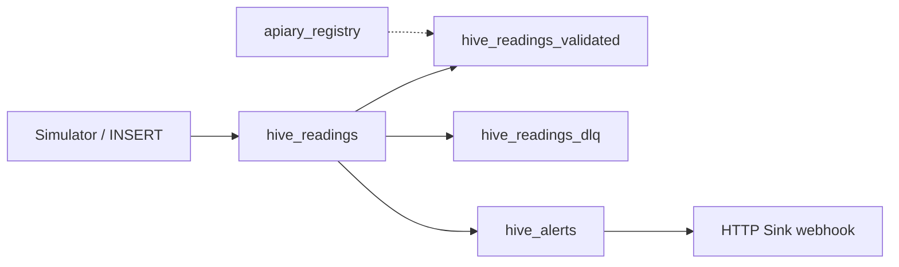

# ApiaryPulse

**ApiaryPulse** is a reference streaming application for **remote beehive monitoring** on [Confluent Cloud](https://confluent.cloud). It ingests governed sensor telemetry, validates readings in **Apache Flink**, emits **rule-based alerts** (no machine learning), routes bad data to a **dead-letter topic**, and can notify beekeepers via an **HTTP Sink** webhook.

Urban apiaries and agricultural cooperatives use hive scales and in-hive sensors to watch colony health. Batch dashboards are often too slow for swarms, theft, or environmental stress. ApiaryPulse shows how to detect those conditions in **minutes** with stream processing, **Schema Registry**, and clear **stream lineage**.

---

## Features

- **Governed ingest** - Avro payloads on `hive_readings` with Schema Registry subjects
- **Dimension data** - `apiary_registry` upsert table for apiary/hive metadata
- **Validation stream** - `hive_readings_validated` with watermarked event time
- **Dead-letter queue** - `hive_readings_dlq` with `reject_reason` for out-of-range readings
- **Alerting** - 3-minute tumbling windows on `hive_readings` → `hive_alerts`
- **Delivery** - Confluent **HTTP Sink** on `hive_alerts` (optional FastAPI receiver in this repo)
- **Demo producer** — Python simulator for three hives with optional swarm / bad-reading scenarios

Detection is **deterministic** (thresholds and windows only). There is **no AI/ML** in the pipeline.

---

## Architecture

```text
                    ┌─────────────────────┐
  Python simulator  │   hive_readings     │
  (or Flink INSERT) └──────────┬──────────┘
                               │
         ┌─────────────────────┼─────────────────────┐
         ▼                     ▼                     ▼
  Flink INSERT           Flink CTAS              Flink CTAS
  validated              DLQ                     alerts (3m windows)
         │                     │                     │
         ▼                     ▼                     ▼
 hive_readings_validated  hive_readings_dlq      hive_alerts ──► HTTP Sink
                               ▲
                    apiary_registry (seeded dimension)
```



### Kafka topics / Flink tables

| Table | Mode | Role |
|-------|------|------|
| `hive_readings` | Append stream | Raw sensor events (weight, temp, humidity, activity) |
| `apiary_registry` | Upsert | Hive/apiary names, region, baseline weight |
| `hive_readings_validated` | Append | Physically plausible readings only |
| `hive_readings_dlq` | Append | Rejected readings + `reject_reason` |
| `hive_alerts` | Append | Rule-fired alerts for notification |

### Alert rules (`06_job_hive_alerts.sql`)

| `alert_type` | Severity | Condition (per hive, 3-minute window) |
|--------------|----------|--------------------------------------|
| `SWARM_OR_THEFT_SUSPECT` | CRITICAL | Weight swing ≥ 10 kg |
| `BROOD_TEMP_STRESS` | WARN | Average temp outside 32–36 °C |
| `HUMIDITY_STRESS` | WARN | Average humidity outside 40–70% |

Validation bounds for ingest match the DLQ job (weight 5–150 kg, temp −5–55 °C, humidity 0–100%).

---

## Prerequisites

- Confluent Cloud account with:
  - One **Kafka cluster**
  - **Schema Registry** in the same environment
  - **Flink compute pool** in the same cloud region
- [uv](https://docs.astral.sh/uv/) for Python (`brew install uv` on macOS)
- Python **3.9+**

---

## Quick start

### 1. Clone and install

```bash
git clone https://github.com/Hemantgg/apiary-pulse.git
cd apiary-pulse
uv sync
cp credentials.env.example credentials.env
```

### 2. Credentials

Create **two** API keys in Confluent Cloud (do not reuse the same key for both):

| Variable | Source |
|----------|--------|
| `KAFKA_BOOTSTRAP` | Kafka cluster → bootstrap server |
| `KAFKA_API_KEY` / `KAFKA_API_SECRET` | Kafka cluster → API keys |
| `SR_URL` | Schema Registry → public endpoint |
| `SR_API_KEY` / `SR_API_SECRET` | Schema Registry → **API credentials** |

Edit `credentials.env` (never commit this file).

### 3. Deploy Flink SQL

Open **Flink → SQL workspace**. Set **catalog** to your environment and **database** to your Kafka cluster name.

Run scripts **in order**:

| Step | File |
|------|------|
| 1 | `flink/01_create_hive_readings.sql` |
| 2 | `flink/02_create_apiary_registry.sql` |
| 3 | `flink/03_seed_apiary_registry.sql` |
| 4 | `flink/04_job_readings_validated.sql` (CREATE + INSERT) |
| 5 | `flink/05_job_readings_dlq.sql` |
| 6 | `flink/06_job_hive_alerts.sql` |

Verify:

```sql
SHOW TABLES;
SELECT * FROM hive_readings LIMIT 5;
```

### 4. Produce telemetry

```bash
uv run python scripts/run_simulator.py
```

| Environment variable | Values | Effect |
|---------------------|--------|--------|
| `SIM_SCENARIO` | `normal` (default) | Gentle drift |
| | `swarm` | Rapid weight loss on HIVE-ALPHA |
| | `theft` | Gradual loss on HIVE-BETA |
| | `bad_reading` | Occasional invalid weight → DLQ |
| `SIM_INTERVAL_SEC` | e.g. `8` | Seconds between batches |

Optional sample rows without the simulator: `flink/00_seed_readings_manual.sql`.

After data flows, wait at least **one 3-minute window** (or use `swarm`), then:

```sql
SELECT * FROM hive_alerts;
SELECT * FROM hive_readings_dlq;
```

### 5. HTTP Sink (webhook)

Start the sample receiver:

```bash
uv run uvicorn scripts.alert_receiver:app --host 0.0.0.0 --port 8787
```

In Confluent Cloud: **Connectors → HTTP Sink** → topic **`hive_alerts`** → URL `http://<host>:8787/webhook` (use a tunnel such as ngrok for a public URL).

List received payloads: `GET http://localhost:8787/alerts`

---

## Project layout

```text
apiary-pulse/
├── flink/                 # Flink SQL (DDL + streaming jobs)
├── schemas/               # Avro schema definitions
├── datagen/               # Hive telemetry simulator
├── scripts/
│   ├── run_simulator.py
│   └── alert_receiver.py  # HTTP Sink target
├── credentials.env.example
├── pyproject.toml
└── uv.lock
```

---

## Schemas

Avro records (registered when Flink tables are created):

| File | Subject (typical) | Purpose |
|------|-------------------|---------|
| `schemas/hive_reading.avsc` | `hive_readings-value` | Sensor reading event |
| `schemas/hive_alert.avsc` | `hive_alerts-value` | Alert emitted by Flink |
| `schemas/apiary_registry.avsc` | `apiary_registry-value` | Hive/apiary dimension row |

Set Schema Registry compatibility to **BACKWARD** before adding optional fields (e.g. `battery_pct` on readings).

---

## Example queries

```sql
-- Latest raw readings
SELECT hive_id, weight_kg, temp_c, humidity_pct, observed_at
FROM hive_readings
ORDER BY observed_at DESC
LIMIT 10;

-- Enrich validated readings with registry (ad-hoc)
SELECT v.*, r.apiary_name, r.region
FROM hive_readings_validated v
LEFT JOIN apiary_registry r ON v.hive_id = r.hive_id
LIMIT 20;

-- Open alerts
SELECT alert_type, severity, summary, triggered_at
FROM hive_alerts;
```

---

## Connectors used

- **Native Kafka table connector** (`connector = confluent`) via Flink SQL for all topics
- **HTTP Sink Connector** on `hive_alerts` for outbound notifications

---

## License

MIT — see [LICENSE](LICENSE).
